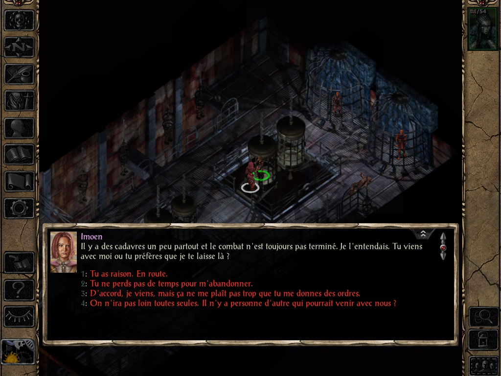

<h1>Correction de la traduction de Baldur's Gate II : Enhanced Edition</h1>

<h3>Un mod développé sur <a href="https://www.baldursgateworld.fr">La Couronne de Cuivre</a> pour BG2:EE (v2.6+) et EET (v13+)<h3>

 

**Auteurs :** <a href="https://www.baldursgateworld.fr/lacouronne/members/lefreut.html">Lefreut</a> et <a href="https://www.baldursgateworld.fr/lacouronne/members/jazira.html">Jazira</a>
**Forum du mod :** <a href="https://www.baldursgateworld.fr">Correction de la traduction de Baldur's Gate II : Enhanced Edition</a>

 

<a href="#intro">Présentation</a> &#8226; <a href="#compat">Compatibilité</a> &#8226; <a href="#installation">Installation</a> &#8226; <a href="#components">Composants</a> &#8226; <a href="#images">Captures d'écran</a> &#8226; <a href="#credits">Crédits et remerciements</a> &#8226; <a href="#versions">Historique des versions</a> 

## Présentation

Ce mod a pour objectif de corriger la traduction française de Baldur's Gate II : Enhanced Edition.
En effet, le patch 2.6 de BG2:EE propose une toute nouvelle traduction française officielle, par le prestataire de Beamdog : Mogi Group.
Bien que cela ouvre de nouvelles perspectives, certaines modifications arbitraires des textes originaux de la traduction française, comme les vouvoiements/tutoiements, par exemple Imoen qui vouvoie le personnage joueur, ou encore des changements de noms propres, par exemple « Spellhold » qui devient « Brisesort », pour ne citer qu'eux, ne sont pas compatibles avec le travail de traduction et de relecture effectué par les traducteurs et relecteurs francophones bénévoles depuis maintenant plus de 20 ans.
De plus, de nombreuses corrections supplémentaires ont été intégrées à cette traduction, voir la section <a href="#compon">Composants</a> pour plus de détails. Merci de nous signaler toute éventuelle faute à corriger sur le <a href="https://www.baldursgateworld.fr">Forum du mod</a>.

<a href="#top">Retour en haut de page</a>

## Compatibilité

#### Jeux concernés

Le mod « Correction de la traduction de Baldur's Gate II : Enhanced Edition » est conçu pour fonctionner sur BG2:EE (v2.6+) et EET (v13+).

#### Compatibilité avec les autres mods

« Correction de la traduction de Baldur's Gate II : Enhanced Edition » est un mod WeiDU et devrait par conséquent être compatible avec n'importe quel mod WeiDU. Si vous rencontrez des bugs, veuillez contacter <a href="https://www.baldursgateworld.fr/lacouronne/members/lefreut.html">Lefreut</a> ou <a href="https://www.baldursgateworld.fr/lacouronne/members/jazira.html">Jazira</a>, ou encore de poster dans le <a href="https://www.baldursgateworld.fr">Forum du mod</a>.

#### Ordre d'installation

Veuillez installer « Correction de la traduction de Baldur's Gate II : Enhanced Edition » avant tout autre mod, notamment EET.

<a href="#top">Retour en haut de page</a>

## Installation

#### Mise en garde

*Si une ancienne version de ce mod est déjà installée, il est nécessaire de la désinstaller d'abord. Pour cela, lancez __`setup-correctfrbg2ee.exe`__ (ou .command si vous êtes sous OS X) et désinstallez tous les composants précédemment installés. Une fois la désinstallation achevée, supprimez le répertoire :file_folder: __correctfrbg2ee__ et le fichier __setup-correctfrbg2ee.exe__ (version Windows) avant d'extraire la nouvelle version du mod.*

*Lorsque vous installez ou désinstallez, __ne fermez pas la fenêtre DOS__ en cliquant sur le bouton __X__ ! Au lieu de cela, appuyez sur la touche __Entrée__ lorsque l'invite de commandes vous le demande.*

*Par précaution, __désactivez les antivirus__ ou tout logiciel résidant en mémoire avant d'installer ce mod, ou tout autre mod. Certains (en particulier avast et Norton !) ont une fâcheuse tendance à déclarer les exécutables des mods comme des faux positifs, provoquant ainsi l'échec de la procédure d'installation.*

##

#### Note pour les jeux en Édition Améliorée (EE)

Les Éditions améliorées sont des jeux que le développeur fait encore évoluer, notamment par l'ajout de capacités supplémentaires destinées à la création de mods et par l'ajout de contenus. N'oubliez pas que chaque patch de mise à jour effacera les mods que vous avez installés ! Ce mod ne fera pas exception à la règle.

Si vous pouvez retarder la mise à jour du patch en plein milieu d'un partie moddée (si vous en avez la possibilité, notamment chez Beamdog et Good Old Games), n'oubliez pas que même après avoir réinstallé les mods sur un nouveau patch, vous ne pourrez peut-être pas continuer le jeu avec vos anciennes sauvegardes, en particulier à cause de noms de personnages, de lieux, etc., qui pourraient être incorrects. Pour y remédier, copiez tout le dossier du jeu dans un nouveau dossier dans lequel vous installerez vos mods, et qui ne sera pas modifié par les patches de mise à jour. Il est important que vous installiez le mod dans la version linguistique dans laquelle vous jouez. Sinon, les dialogues du mod ne s'afficheront pas et provoqueront des messages d'erreur. 

##

#### Windows

« Correction de la traduction de Baldur's Gate II : Enhanced Edition » pour Windows est livré et installé avec WeiDU, et est diffusé sous forme d'archive.

Vous devez extraire les fichiers de l'archive dans votre répertoire de jeu (*le dossier qui contient le fichier CHITIN.KEY*) à l'aide de <a href="https://www.7-zip.org/download.html">7zip</a> ou de <a href="https://www.rarlab.com/download.htm">WinRAR</a>. Une fois l'archive extraite correctement, vous devriez trouver le répertoire :file_folder: correctfrbg2ee et le fichier setup-correctfrbg2ee.exe dans votre répertoire de jeu. Pour installer le mod, il suffit de double-cliquer sur **`setup-correctfrbg2ee.exe`** et de suivre les instructions affichées à l'écran.

Vous pouvez lancer **`setup-correctfrbg2ee.exe`** dans votre répertoire de jeu pour réinstaller, désinstaller, ou encore changer des composants.

##

#### Mac OS X

« Correction de la traduction de Baldur's Gate II : Enhanced Edition » pour Mac OS X est livré et installé avec WeiDU, et est diffusé dans la même archive compressée.

Extrayez le contenu de l'archive dans votre répertoire de jeu. Après une extraction réussie, ce dernier contiendra les fichiers setup-correctfrbg2ee, setup-correctfrbg2ee.command, et le répertoire :file_folder: correctfrbg2ee. Pour installer, il suffit de double-cliquer sur **`setup-correctfrbg2ee.command`** et de suivre les instructions affichées à l'écran.

Vous pouvez lancer **`setup-correctfrbg2ee.command`** dans votre répertoire de jeu pour réinstaller, désinstaller ou changer des composants.

##

#### Linux

« Correction de la traduction de Baldur's Gate II : Enhanced Edition » pour Linux est diffusé dans la même archive compressée, mais sans l'installateur WeiDU.

Extrayez le contenu du mod dans le répertoire du jeu que vous voulez moder.

Téléchargez la version la plus récente de WeiDU pour Linux sur <a href="https://github.com/WeiDUorg/weidu/releases">WeiDU.org</a> et copiez weidu, weinstall et tolower dans `/usr/local/bin` (créez-le s'il n'existe pas). Ouvrez ensuite un terminal et allez (**`cd`**) dans le répertoire d'installation de votre jeu, lancez **`/usr/local/bin/tolower`** et répondez « Y » aux deux questions. Vous pouvez éviter d'exécuter la seconde option (Linux.ini) si vous l'avez déjà lancée une fois dans le même dossier. Pour gagner du temps, l'archive est déjà passée en minuscules, aussi il n'est pas non plus nécessaire d'exécuter la première option (passer les noms de fichiers en minuscules) si vous n'avez extrait que ce mod depuis la dernière fois que vous avez passé les noms de fichiers en minuscules. Si vous avez un doute, il vaut mieux exécuter tolower et accepter les deux options.

Tapez la commande **`export PATH=$PATH:/usr/local/bin`**, puis lancez **`weinstall setup-correctfrbg2ee`** depuis le dossier de votre jeu pour installer le mod. Puis, lancez **`wine baldur.exe`** et commencez à jouer.

##

#### Note pour effectuer une désinstallation complète

En plus des méthodes détaillées plus haut pour supprimer des composants, il est possible de désinstaller complètement le mod en tapant **`setup-correctfrbg2ee --uninstall`** dans une ligne de commandes, ce qui supprimera tous les composants sans devoir ingurgiter tous les messages. 

<a href="#top">Retour en haut de page</a>

## Composants

Le programme d'installation comprend les composants suivants. Chacun possède un numéro distinct et pré-défini qui lui attribue une position déterminée (mot-clé *`DESIGNATED`* en langage WeiDU) ; ce qui permet aux autres composants et aux autres mods de le détecter et aux utilitaires d'installation automatique de préciser quels composants installer.

##

#### [10] Correction de la traduction de Baldur's Gate II : Enhanced Edition (composant principal)

- Remplacement des textes de la partie originale (BG2 & ToB) de la traduction officielle par les textes du <a href="https://www.baldursgateworld.fr/lacouronne/bg2-ee/31540-mod-semi-officiel-de-traduction-partielle-de-bg2ee-v2-5-a.html">Mod semi-officiel de traduction partielle de BG2EE</a>.
- Importation des corrections du <a href="https://www.baldursgateworld.fr/lacouronne/la-zone-de-telechargement/24082-mods-crees-patch-patch-correctif-des-textes-pour-baldur-s-gate-2-et-tob-en-vf.html">Patch correctif des textes pour Baldur's Gate 2 (et ToB)</a>.
- Correction des tutoiements/vouvoiements.
- Ajout des versions féminines.
- Correction et uniformisation des noms propres (personnage, lieu, organisation, lore, objets, sorts, etc.).
- Correction des non-sens et erreurs de traduction.
- Uniformisation du cartouche des objets et des sorts.
- Uniformisation de la ponctuation (?, !, :, ;, «», ', -, etc.).
- Correction des caractères spéciaux (œ, Œ, Î, Ù, Ê, É, È, À, Ç, etc.).
- Supression des whitespaces et des caractères spéciaux inadéquats.
- Correction des fautes de frappe, d'othographe, de conjugaison et de grammaire.
- Amélioration de la « qualité de vie » (espaces insécables, 10 000, 2 365, etc).

##

#### [20] Correction de la description des objets (nécessite le composant principal)

- Correction de la description de l'Hallebarde elfe noir +3
- Correction de la description du Symbole sacré de Lathandre
- Correction de la description du Symbole sacré de Heaum
- Correction de la description du Symbole sacré de Talos
- Correction de la description du Symbole sacré de Baervan Ermiterrant
- Correction de la description du Symbole sacré de Shar
- Correction de la description du Symbole sacré de Tyr
- Correction de la description du Symbole sacré de Tempus
- Correction de la description de la Lame de Suryris +2
- Correction de la description de la Hache +3 du sort Arme enchantée
- Correction de la description de l'Armure d'écailles de dragon d'ombre
- Correction de la description de l'Armure d'écailles de dragon blanc
- Correction de la description de l'Armure d'écailles de dragon bleu
- Correction de la description de la Cotte de mailles elfe noir +3
- Correction de la description de la Cotte de mailles elfe noir +5
- Correction de la description de l'Épée courte +4 (Figurine de Shakti)

##

#### [30] Ensembles de voix du personnage principal en français

- Inclusion des ensembles de voix pour le personnage principal en français.

##

#### [40] Suppression ensembles de voix Adventurers of Neverwinter

- Supprime les ensembles de voix AoN en anglais pour le personnage principal ajoutées par le patch 2.6.

<a href="#top">Retour en haut de page</a>

## Captures d'écran

#### Avant :

#### Après :

<a href="#top">Retour en haut de page</a>

## Crédits et remerciements

&#9755; Pour toute question ou demande d'assistance, veuillez consulter le <a href="https://www.baldursgateworld.fr">forum du mod</a>.

##

#### Auteurs : <a href="https://www.baldursgateworld.fr/lacouronne/members/lefreut.html">Lefreut</a> et <a href="https://www.baldursgateworld.fr/lacouronne/members/jazira.html">Jazira</a>

##

#### Remerciements particuliers à :

- L'équipe de <a href="https://www.baldursgateworld.fr">La Couronne de Cuivre</a> pour l'hébergement de ce mod.
- Les créateurs de la série Baldur's Gate : <a href="https://www.bioware.com/">Bioware</a> et <a href="https://www.obsidian.net/">Black Isle Studios</a>, ainsi que <a href="https://www.aroundtheword.com/fr/">Around the word</a> pour la traduction française du contenu classique.
- Les créateurs des Éditions Améliorées : <a href="https://www.beamdog.com/">Beamdog</a>, ainsi que <a href="https://mogi-group.com/">Mogi Group</a> pour la traduction française du contenu EE.
- Les créateurs du <a href="https://www.baldursgateworld.fr/lacouronne/bg2-ee/31540-mod-semi-officiel-de-traduction-partielle-de-bg2ee-v2-5-a.html">Mod semi-officiel de traduction partielle de BG2EE</a>.
- Les créateurs du <a href="https://www.baldursgateworld.fr/lacouronne/la-zone-de-telechargement/24082-mods-crees-patch-patch-correctif-des-textes-pour-baldur-s-gate-2-et-tob-en-vf.html">Patch correctif des textes pour Baldur's Gate 2 (et ToB)</a>.
- <a href="https://www.baldursgateworld.fr/lacouronne/members/freddy_gwendo.html">Freddy_Gwendo</a> pour son template de <a href="https://github.com/GwendolyneFreddy/LCC-Readme">readme</a>.
- Merci à toutes les personnes des forums de <a href="https://www.baldursgateworld.fr">La Couronne de Cuivre</a>, <a href="https://www.gibberlings3.net/forums/">The Gibberlings Three</a>, <a href="http://www.shsforums.net/">Spellhold Studios</a>, et des autres communautés de joueurs et de moddeurs IE qui nous ont offert leur aide.

##

#### Logiciels et outils utilisés pour la réalisation de ce mod :

- <a href="https://github.com/WeiDUorg/weidu/releases">WeiDU</a> de Wes Weimer, the bigg et Wisp.
- <a href="https://github.com/Argent77/NearInfinity/releases">Near Infinity</a> de Jon Olav Hauglid, FredSRichardson et Argent77.
- <a href="https://www.gimp.org/">GIMP</a> par l'équipe de the GIMP.
- <a href="http://notepad-plus-plus.org/">Notepad++</a> par l'équipe de Notepad++, Don Ho.
- <a href="https://github.com/">GitHub</a> par l'équipe de GitHub.
- <a href="https://tortoisegit.org/">TortoiseGit</a> par l'équipe de TortoiseGit.

##

#### Information sur les droits d'auteur

###### Le mod « Correction de la traduction de Baldur's Gate II : Enhanced Edition » n'est pas développé, supporté ni approuvé par BioWare&trade; ou Interplay/Black Isle, Overhaul, Beamdog ou Wizards of the Coast. Il a été développé par Lefreut et Jazira, et est basé sur le jeu Baldur's Gate II : Enhanced Edition.
###### Tout le contenu du mod appartient à &copy; Lefreut et Jazira.
###### Baldur's Gate II : Les Ombres d'Amn et Baldur's Gate II : Trône de Bhaal appartiennent à &copy; TSR, Inc. Le moteur Infinity Engine appartient à &copy; BioWare Corp. Toutes les autres marques et droits d'auteur appartiennent à leurs propriétaires respectifs.

###### Ce mod a été créé pour être librement apprécié par tous les joueurs de Baldur's Gate II : Enhanced Edition. Cependant, il ne doit pas être vendu, publié, compilé ou redistribué sous une forme quelconque sans le consentement de ses auteurs.
###### Veuillez noter que tout partage ou hébergement de ce mod est interdit sans la permission des auteurs.

###### S'il existe des problèmes de droits d'auteur ou si cette déclaration nécessite une révision, veuillez nous contacter et conseillez-nous sur ce qu'il faut faire à ce sujet. Plus particulièrement, si vous trouvez dans ce mod des illustrations susceptibles d'être en conflit avec les règles de droit d'auteur, merci de bien vouloir nous le faire savoir dès que possible et nous supprimeront immédiatement le contenu en conflit.

######  Ce module (y compris l'intégralité du code et de la documentation) est déposé sous la licence <a href="https://creativecommons.org/licenses/by-sa/3.0/deed.en_US">Creative Commons Attribution-ShareAlike 3.0 Unported License</a>. Vous êtes libre de partager (copier, distribuer et transmettre) et de modifier (adapter) ce travail, à des fins non commerciales. Si vous souhaitez des précisions, veuillez consulter la <a href="https://creativecommons.org/licenses/by-nc/3.0/legalcode">Creative Commons Public License</a>.
###### Tous les copyrights et marques commerciales appartiennent à leurs propriétaires respectifs.

###### La communauté de modding sur le moteur Infinity Engine a été très active depuis plus de vingt ans maintenant, et a produit des milliers d'heures de travail non rémunérées effectuées par des fans du jeu. Les moddeurs, traducteurs et relecteurs s'efforcent de publier le meilleur de leur travail, et les joueurs bénéficient des mods les plus performants et les mieux maintenus, à condition que nous travaillions tous dans le même sens.
###### Mais cette harmonie peut malheureusement être perturbée, principalement par deux comportements. Le premier, c'est de revendiquer le travail de quelqu'un d'autre. Le second consiste à héberger et à redistribuer un mod sans la permission de son(es) auteur(s).
###### Soyez assez sympa avec vos collègues joueurs, moddeurs, traducteurs et relecteurs. Ne le faites pas. 

<a href="#top">Retour en haut de page</a>

## Historique des versions

#### Version 0.5 &nbsp;(6 août 2021)

  - Nouveau composant Ensembles de voix du personnage principal en francais.
  - Nouveau composant Suppression ensembles de voix Adventurers of Neverwinter.
  - Uniformisation du cartouche des objets et des sorts.
  - Correction des caractères spéciaux (œ, Œ, Î, Ù, Ê, É, È, À, Ç, etc.).
  - Amélioration de la « qualité de vie » (espaces insécables, 10 000, 2 365, etc).

#### Version 0.4 &nbsp;(19 juillet 2021)

  - Nouveau composant Correction de la description des objets.
  - Uniformisation du cartouche des objets et des sorts.
  - Uniformisation de la ponctuation (?, !, :, ;, «», ', -, etc.).
  - Correction des caractères spéciaux (œ, Œ, Î, Ù, Ê, É, È, À, Ç, etc.).

#### Version 0.3 &nbsp;(14 juillet 2021)

  - Uniformisation du cartouche des objets et des sorts.
  - Uniformisation de la ponctuation (?, !, :, ;, «», ', -, etc.).
  - Correction des caractères spéciaux (œ, Œ, Î, Ù, Ê, É, È, À, Ç, etc.).
  - Amélioration de la « qualité de vie » (espaces insécables, 10 000, 2 365, etc).

#### Version 0.2 &nbsp;(05 juillet 2021)

  - Fusion 2.6 + bg2eetrans + pack de corrections.

#### Version 0.1 &nbsp;(01 juillet 2021)

  - Version prototype.

<a href="#top">Retour en haut de page</a>

