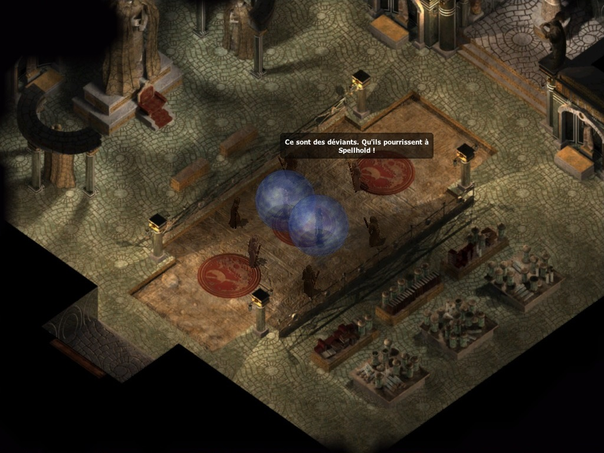

<h1>Correction de la traduction de Baldur's Gate II : Enhanced Edition</h1>

<h3>Un mod développé sur <a href="https://www.baldursgateworld.fr">La Couronne de Cuivre</a> pour BG2:EE (v2.6+) et EET (v13+)<h3>

 

**Auteurs :** <a href="https://www.baldursgateworld.fr/lacouronne/members/lefreut.html">Lefreut</a> et <a href="https://www.baldursgateworld.fr/lacouronne/members/jazira.html">Jazira</a>

**Forum du mod :** <a href="https://www.baldursgateworld.fr/lacouronne/correction-de-la-traduction-de-baldur-s-gate-ii-enhanced-edition/">Correction de la traduction de Baldur's Gate II : Enhanced Edition</a>

 

<a href="#intro">Présentation</a> &#8226; <a href="#compat">Compatibilité</a> &#8226; <a href="#components">Composants</a> &#8226; <a href="#images">Captures d'écran et vidéos</a> &#8226; <a href="#credits">Crédits et remerciements</a> &#8226; <a href="#versions">Historique des versions</a> 

## Présentation

Ce mod a pour objectif de corriger la traduction française de Baldur's Gate II : Enhanced Edition, ainsi que de proposer une version française complète digne de ce nom, aussi bien au niveau des textes que du doublage audio.

En effet, le <a href="https://forums.beamdog.com/discussion/81909/patch-2-6-launches-today">patch 2.6</a> de <acronym title="Baldur's Gate II : Enhanced Edition">BG2:EE</acronym> sorti en avril 2021, propose une toute nouvelle traduction française officielle réalisée par le prestataire de <a href="https://www.beamdog.com/">Beamdog</a> : <a href="https://mogi-group.com/">Mogi Group</a>. Désespérément attendu depuis novembre 2013 par la communauté française, ce nouveau patch traduit notamment le contenu Enhanced Edition.

Bien que cette nouvelle traduction officielle ouvre de nouvelles perspectives, elle comporte également certaines régressions majeures. Comme par exemple : l'absence totale de doublage audio en français (<a href="#doublage">par exemple la comparaison du doublage BG2:EE/BG2/CorrectfrBG2EE</a>) ou encore de dialogue accordé au féminin pour le personnage joueur (<a href="#images">par exemple la réponse 4</a>), qui étaient pourtant bien présents dans le jeu original.

Par ailleurs, de nombreuses modifications arbitraires des textes originaux ne sont pas compatibles avec le travail effectué par les traducteurs et relecteurs francophones bénévoles depuis maintenant plus de 20 ans. Comme par exemple : le vouvoiement systématique (<a href="#images">par exemple Imoen qui vouvoie le personnage joueur, ou l'inverse</a>), ou encore des changements de noms propres (<a href="#images2">par exemple « Spellhold » qui devient « Brisesort »</a>), pour ne citer qu'eux.

Nous constatons donc que la fidélité et la qualité de cette nouvelle traduction officielle ne correspondent pas aux attentes de la communauté.

Notre objectif est d'être aussi fidèle que possible aux textes originaux, sans pour autant être obstinément fermé à certaines corrections et améliorations de cette nouvelle traduction officielle, afin d'en tirer le meilleur parti de chacune. De plus, de nombreuses corrections et améliorations supplémentaires ont été intégrées aux textes et aux doublages originaux, voir la section <a href="#components">Composants</a> pour plus de détails.

Toute suggestion pour améliorer ce mod, ainsi que tout bénévole souhaitant apporter sa pierre à l'édifice, sont plus que bienvenus. Ce mod se veut être communautaire, n'hésitez pas à vous impliquer !

Merci de nous signaler toute éventuelle faute à corriger sur le <a href="https://www.baldursgateworld.fr/lacouronne/correction-de-la-traduction-de-baldur-s-gate-ii-enhanced-edition/">Forum du mod</a>.

<a href="#top">Retour en haut de page</a>

## Compatibilité

#### Jeux concernés

Le mod « Correction de la traduction de Baldur's Gate II : Enhanced Edition » est conçu pour fonctionner sur BG2:EE (v2.6+) et EET (v13+).

#### Compatibilité avec les autres mods

« Correction de la traduction de Baldur's Gate II : Enhanced Edition » est un mod WeiDU et devrait par conséquent être compatible avec n'importe quel mod WeiDU. Si vous rencontrez des bugs, veuillez contacter <a href="https://www.baldursgateworld.fr/lacouronne/members/lefreut.html">Lefreut</a> ou <a href="https://www.baldursgateworld.fr/lacouronne/members/jazira.html">Jazira</a>, ou encore poster dans le <a href="https://www.baldursgateworld.fr/lacouronne/correction-de-la-traduction-de-baldur-s-gate-ii-enhanced-edition/">Forum du mod</a>.

#### Ordre d'installation

Veuillez installer « Correction de la traduction de Baldur's Gate II : Enhanced Edition » avant tout autre mod, notamment EET.

#### Language du doublage vidéo et audio

« Correction de la traduction de Baldur's Gate II : Enhanced Edition » vous offre 3 options au sujet du doublage vidéo et audio :

- __VF+VO__ ; Doublage français corrigé, doublage anglais par défaut du contenu Enhanced Edition conservé :
	- Nécessite le composant __[30] Patch audio et vidéo français.__
	
- __VF__ ; Doublage français corrigé uniquement, bruitage du contenu Enhanced Edition conservé :
	- Nécessite les composants __[30] Patch audio et vidéo français__ + __[40] Suppression des doublages en anglais.__
	
- __VO__ ; Doublage en anglais uniquement :
	- N'installez pas les composants __[30] Patch audio et vidéo français__ et __[40] Suppression des doublages en anglais.__

<a href="#top">Retour en haut de page</a>

## Composants

Le programme d'installation comprend les composants suivants. Chacun possède un numéro distinct et pré-défini qui lui attribue une position déterminée ; ce qui permet aux autres composants et aux autres mods de le détecter et aux utilitaires d'installation automatique de préciser quels composants installer.

##

#### [10] Correction de la traduction de Baldur's Gate II : Enhanced Edition

- Remplacement des textes de la partie originale (BG2 & ToB) de la traduction officielle par les textes du <a href="https://www.baldursgateworld.fr/lacouronne/bg2-ee/31540-mod-semi-officiel-de-traduction-partielle-de-bg2ee-v2-5-a.html">Mod semi-officiel de traduction partielle de BG2EE</a>.
- Importation des corrections du <a href="https://www.baldursgateworld.fr/lacouronne/la-zone-de-telechargement/24082-mods-crees-patch-patch-correctif-des-textes-pour-baldur-s-gate-2-et-tob-en-vf.html">Patch correctif des textes pour Baldur's Gate 2 (et ToB)</a>.
- Importation des corrections de la traduction française officielle du patch 2.6.
- Ajout des versions féminines manquantes et suppression des versions féminines inadéquates.
- Ajout des onomatopées, actions et interjections dans les « sous-titres » des répliques doublées pour les malentendants (Aïe !, Hmmmm..., \*soupire\*, etc.).
- Correction des « sous-titres » pour les répliques doublées en français.
- Correction des tutoiements/vouvoiements.
- Correction et uniformisation des noms propres (personnages, lieux, organisations, lore, objets, sorts, etc.).
- Correction et uniformisation des onomatopées, actions et interjections (\*sanglote\*, \*rester silencieux\*, \*rote\*, etc.).
- Correction des non-sens et des erreurs de traduction.
- Correction des caractères spéciaux (æ, ō, œ, Œ, Î, Ù, Ê, É, È, À, Ç, Ô, etc.).
- Correction des fautes de frappe, d'orthographe, de conjugaison et de grammaire.
- Uniformisation du cartouche des objets et des sorts.
- Uniformisation de la casse et de la ponctuation (?, !, :, ;, «, », ', -, etc.).
- Suppression des whitespaces et des caractères spéciaux inadéquats.
- Amélioration de la « qualité de vie » (espaces insécables, 10 000, 2 365, etc.).
- Réduction du nombre de majuscules dans les noms communs (Tante, Elfe Noir, le Très Noble Ordre des Chevaliers du Cœur Radieux, etc.).
- Réduction des anglicismes (ok, hello, ranger, yeah, etc.).

##

#### [20] Correction de la description des objets (nécessite le composant "Correction de la traduction de Baldur's Gate II : Enhanced Edition")

- Correction de la description de l'Armure d'écailles de dragon blanc.
- Correction de la description de l'Armure d'écailles de dragon bleu.
- Correction de la description de l'Armure d'écailles de dragon d'ombre.
- Correction de la description de l'Épée courte +4 (Figurine de Shakti).
- Correction de la description de la Cotte de mailles elfe noir +3.
- Correction de la description de la Cotte de mailles elfe noir +5.
- Correction de la description de la Hache +3 (Arme enchantée).
- Correction de la description de la Hallebarde elfe noir +3.
- Correction de la description de la Lame de Suryris +2.
- Correction de la description du Symbole sacré de Baervan Ermiterrant.
- Correction de la description du Symbole sacré de Heaum.
- Correction de la description du Symbole sacré de Lathandre.
- Correction de la description du Symbole sacré de Shar.
- Correction de la description du Symbole sacré de Talos.
- Correction de la description du Symbole sacré de Tempus.
- Correction de la description du Symbole sacré de Tyr.

##

#### [30] Patch audio et vidéo français

- Inclusion des ensembles de voix doublées en français pour le personnage principal.
- Inclusion des répliques doublées en français.
- Inclusion des vidéos doublées en français.
- Importation des ensembles de voix doublées en français de BG1 pour le personnage principal.
- Les répliques non doublées en français sont conservées.
- Correction (et/ou ajout) des répliques doublées :
	- [AERIE91], [AERIEC8], [ANOM2517], [ANOM2536], [ANOMEN82], [ANOMENC7], [ARAN09], [BARONP06], [BAZDR310], [BDHIGG13], [BDHIGG14], [CELOGA10], [CERND68], [CERND70], [CERND81], [CSCLER02], [CSCLER03], [CSIMO67], [DPJON119], [EDWIN46], [EDWIN88], [FEMER01], [FFACT204], [GORTAN01], [HAER2508], [HAERDA54], [HELFEA11], [HELGRE07], [HELPRI03], [HELPRI16], [HUMAN05], [IMOEN74], [IRENIC66], [JAHEIR52], [JAHEIRB2], [JAHEIRBX], [JANJAN68], [KORGAN18], [KORGAN36], [KORGAN59], [KORGAN66], [KORGAN70], [LEOPA05], [MINS2507], [MINSC67], [NALIA57], [NALIA63], [NALIA79], [NALIA82], [PEASM305], [PPBHAA03], [PPBHAA06], [PPBHAA07], [PPBHAA08], [RIFTG08], [SOLAR22], [SOLAR29], [SOLAR30], [SOLAR32], [SOLAR39], [SOLAR43], [SOLAR61], [SOLAR72], [SOLAR77], [SOLAR82], [SOLAR84], [SOLAR85], [SOLAR89], [SOLAR99], [SOLAR100], [SOLF06], [SOLF07], [SOLF08], [SSWORD13], [SSWORD66], [TRGENI09], [TRGENI10], [TRGENI11], [VALYGA15], [VALYGA78], [VALYGA88], [VICO2510], [VICONI48], [VICONI63], [VICONIC2], [VICONIC4], [VICONID1], [YOSHIM44], [YOSHIM49].

##

#### [40] Suppression des doublages en anglais (nécessite le composant "Patch audio et vidéo français")

- Suppression des ensembles de voix en anglais de Adventurers of Neverwinter pour le personnage principal ajoutées par le patch 2.6.
- Suppression des répliques non doublées en français.
- Les doublages de type « bruitages » du contenu Enhanced Edition sont conservés.

<a href="#top">Retour en haut de page</a>

## Captures d'écran et vidéos

Comparez les captures d'écran des textes (BG2:EE/CorrectfrBG2EE).

#### BG2:EE :

#### CorrectfrBG2EE :

#### BG2:EE :

#### CorrectfrBG2EE :

##

#### Doublage

Cliquer sur les vidéos vous redirigera vers youtube, où vous pourrez comparer les différentes versions du doublage (BG2:EE/BG2/CorrectfrBG2EE).

[KORGAN36]

&nbsp;

[![[KORGAN36]](correctfrbg2ee/readme/images/video.png)](https://youtu.be/Ex2oBv2zXwU "[KORGAN36]")

 

[VICONID1]

&nbsp;

[![[VICONID1]](correctfrbg2ee/readme/images/video.png)](https://youtu.be/Ha92mWe3S24 "[VICONID1]")

 

<a href="#top">Retour en haut de page</a>

## Crédits et remerciements

#### Auteurs : <a href="https://www.baldursgateworld.fr/lacouronne/members/lefreut.html">Lefreut</a> et <a href="https://www.baldursgateworld.fr/lacouronne/members/jazira.html">Clément « Jazira » Bizieau</a>

##

#### Remerciements particuliers à :

- Nos contributeurs, relecteurs, bêta-testeurs, etc. :
	- Maud « Elisabeth » Fanny
	- Tiffany « GrootIsntTree » Goalec
	- Machiavélique
	- Mickaël Leduque
	- Mera
	- JohnBob
	- Freddy_Gwendo
	- Mickabouille
	- Deratiseur
	- Le Marquis
	- Nixou
	- Sloth
- Les créateurs du <a href="https://www.baldursgateworld.fr/lacouronne/bg2-ee/31540-mod-semi-officiel-de-traduction-partielle-de-bg2ee-v2-5-a.html">Mod semi-officiel de traduction partielle de BG2EE</a> :
	- Lionel « La Voix 2 la sagesse » Bayle-Denise
	- Denis « Isaya » Ribayrol
	- Freddy_Gwendo
	- Luren
	- David « Graoumf » Pascaud
	- McGregor777
	- N3ige
	- Scylla
	- slip
	- sombrepiaf
	- zelurker
	- Cruller
	- Leninator
- Les créateurs du <a href="https://www.baldursgateworld.fr/lacouronne/la-zone-de-telechargement/24082-mods-crees-patch-patch-correctif-des-textes-pour-baldur-s-gate-2-et-tob-en-vf.html">Patch correctif des textes pour Baldur's Gate 2 (et ToB)</a> :
	- Mornagest 
	- Zefklop
	- Denis « Isaya » Ribayrol
	- Freddy_Gwendo
- Freddy_Gwendo pour son template de <a href="https://github.com/GwendolyneFreddy/LCC-Readme">readme</a>.
- L'équipe de <a href="https://www.baldursgateworld.fr">La Couronne de Cuivre</a> pour l'hébergement de ce mod.
- Les créateurs de la série Baldur's Gate : <a href="https://www.bioware.com/">Bioware</a> et <a href="https://www.obsidian.net/">Black Isle Studios</a>, ainsi que <a href="https://www.aroundtheword.com/fr/">Around the word</a> pour la traduction française du contenu classique.
- Les créateurs des Éditions Améliorées : <a href="https://www.beamdog.com/">Beamdog</a>, ainsi que <a href="https://mogi-group.com/">Mogi Group</a> pour la traduction française du contenu EE.
- L'équipe des d'Oghmatiques pour leurs nombreuses traductions, ainsi qu'à tous les bénévoles moddeurs, traducteurs, relecteurs de la communauté française.
- Merci à toutes les personnes des forums de <a href="https://www.baldursgateworld.fr">La Couronne de Cuivre</a>, <a href="https://www.gibberlings3.net/forums/">The Gibberlings Three</a>, <a href="http://www.shsforums.net/">Spellhold Studios</a>, et des autres communautés de joueurs et de moddeurs IE.

##

#### Logiciels et outils utilisés pour la réalisation de ce mod :

- <a href="https://github.com/WeiDUorg/weidu/releases">WeiDU</a> de Wes Weimer, the bigg et Wisp.
- <a href="https://github.com/Argent77/NearInfinity/releases">Near Infinity</a> de Jon Olav Hauglid, FredSRichardson et Argent77.
- <a href="https://www.gimp.org/">GIMP</a> par l'équipe de the GIMP.
- <a href="http://notepad-plus-plus.org/">Notepad++</a> par l'équipe de Notepad++, Don Ho.
- <a href="https://github.com/">GitHub</a> par l'équipe de GitHub.
- <a href="https://tortoisegit.org/">TortoiseGit</a> par l'équipe de TortoiseGit.
- <a href="https://www.audacityteam.org/">Audacity</a> par l'équipe d'Audacity.

##

#### Information sur les droits d'auteur

###### Le mod « Correction de la traduction de Baldur's Gate II : Enhanced Edition » n'est pas développé, supporté ni approuvé par BioWare&trade; ou Interplay/Black Isle, Overhaul, Beamdog ou Wizards of the Coast. Il a été développé par Lefreut et Jazira, et est basé sur le jeu Baldur's Gate II : Enhanced Edition.
###### Tout le contenu du mod appartient à &copy; Lefreut et Jazira.
###### Baldur's Gate II : Les Ombres d'Amn et Baldur's Gate II : Trône de Bhaal appartiennent à &copy; TSR, Inc. Le moteur Infinity Engine appartient à &copy; BioWare Corp. Toutes les autres marques et droits d'auteur appartiennent à leurs propriétaires respectifs.

###### Ce mod a été créé pour être librement apprécié par tous les joueurs de Baldur's Gate II : Enhanced Edition. Cependant, il ne doit pas être vendu, publié, compilé ou redistribué sous une forme quelconque sans le consentement de ses auteurs.
###### Veuillez noter que tout partage ou hébergement de ce mod est interdit sans la permission des auteurs.

###### S'il existe des problèmes de droits d'auteur ou si cette déclaration nécessite une révision, veuillez nous contacter et nous conseiller sur la démarche à suivre. Plus particulièrement, si vous trouvez dans ce mod des illustrations susceptibles d'être en conflit avec les règles de droits d'auteur, merci de bien vouloir nous le faire savoir dès que possible et nous supprimerons immédiatement le contenu en question.

######  Ce module (y compris l'intégralité du code et de la documentation) est déposé sous la licence <a href="https://creativecommons.org/licenses/by-sa/3.0/deed.en_US">Creative Commons Attribution-ShareAlike 3.0 Unported License</a>. Vous êtes libre de partager (copier, distribuer, transmettre) et de modifier (adapter) ce travail, à des fins non commerciales. Pour plus de précisions, veuillez consulter la <a href="https://creativecommons.org/licenses/by-nc/3.0/legalcode">Creative Commons Public License</a>.
###### Tous les copyrights et marques commerciales appartiennent à leurs propriétaires respectifs.

##

La communauté de modding sur le moteur Infinity Engine a été très active depuis plus de vingt ans maintenant, et a produit des milliers d'heures de travail non rémunérées effectuées par des fans du jeu. Les moddeurs, traducteurs et relecteurs s'efforcent de publier le meilleur de leur travail, et les joueurs bénéficient des mods les plus performants et les mieux maintenus, à condition que nous travaillions tous vers un même but.

Mais cette harmonie peut malheureusement être perturbée, principalement par deux comportements. Le premier, c'est de revendiquer le travail de quelqu'un d'autre. Le second consiste à héberger et à redistribuer un mod sans la permission de son(es) auteur(s).

Soyez assez sympas avec vos collègues joueurs, moddeurs, traducteurs et relecteurs. Ne le faites pas.

<a href="#top">Retour en haut de page</a>

## Historique des versions

#### Version 0.10 &nbsp;(5 février 2022)
  - Correction de fichiers audio.
  - Importation des corrections de la traduction française officielle du patch 2.6.
  - Relecture et uniformisation.

#### Version 0.9 &nbsp;(7 janvier 2022)
  - Correction de fichiers audio.
  - Correction accords féminins.
  - Importation des corrections de la traduction française officielle du patch 2.6.

#### Version 0.8 &nbsp;(24 décembre 2021)
  - Correction des répliques doublées.
  - Correction de fichiers audio.
  - Correction vouvoiement / tutoiement.
  - Correction et uniformisation des onomatopées, actions et interjections (\*sanglote\*, \*rester silencieux\*, \*rote\*, etc.).
  - Importation des corrections de la traduction française officielle du patch 2.6.

#### Version 0.7 &nbsp;(27 octobre 2021)

  - Correction des « sous-titres » pour les répliques doublées en français.
  - Importation des ensembles de voix doublées en français de BG1 pour le personnage principal.
  - Inclusion des vidéos doublées en français.

#### Version 0.6 &nbsp;(15 août 2021)

  - Nouveau composant Patch audio francais.
  - Réduction du nombre de majuscules dans les noms communs (Tante, Elfe Noir, le Très Noble Ordre des Chevaliers du Cœur Radieux, etc.).
  - Correction des « sous-titres » pour les répliques doublées en français.

#### Version 0.5 &nbsp;(6 août 2021)

  - Nouveau composant Ensembles de voix du personnage principal en francais.
  - Nouveau composant Suppression ensembles de voix Adventurers of Neverwinter en anglais.
  - Uniformisation du cartouche des objets et des sorts.
  - Correction des caractères spéciaux (æ, ō, œ, Œ, Î, Ù, Ê, É, È, À, Ç, Ô, etc.).
  - Amélioration de la « qualité de vie » (espaces insécables, 10 000, 2 365, etc.).

#### Version 0.4 &nbsp;(19 juillet 2021)

  - Nouveau composant Correction de la description des objets.
  - Uniformisation du cartouche des objets et des sorts.
  - Uniformisation de la casse et de la ponctuation (?, !, :, ;, «, », ', -, etc.).
  - Correction des caractères spéciaux (æ, ō, œ, Œ, Î, Ù, Ê, É, È, À, Ç, Ô, etc.).

#### Version 0.3 &nbsp;(14 juillet 2021)

  - Uniformisation du cartouche des objets et des sorts.
  - Uniformisation de la casse et de la ponctuation (?, !, :, ;, «, », ', -, etc.).
  - Correction des caractères spéciaux (æ, ō, œ, Œ, Î, Ù, Ê, É, È, À, Ç, Ô, etc.).
  - Amélioration de la « qualité de vie » (espaces insécables, 10 000, 2 365, etc.).

#### Version 0.2 &nbsp;(05 juillet 2021)

  - Fusion 2.6 + bg2eetrans + pack de corrections.

#### Version 0.1 &nbsp;(01 juillet 2021)

  - Version prototype.

<a href="#top">Retour en haut de page</a>

